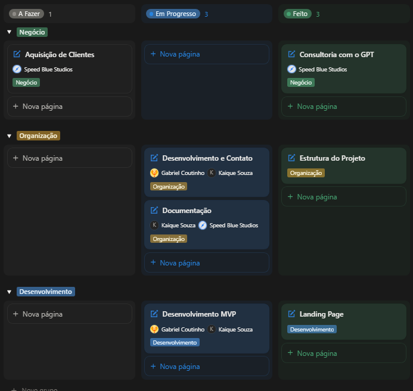
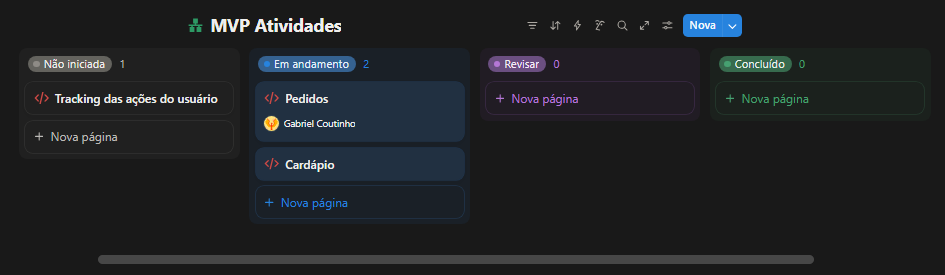
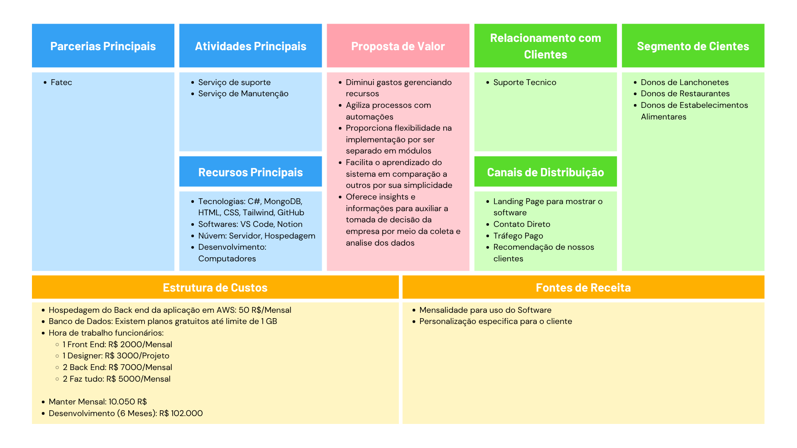
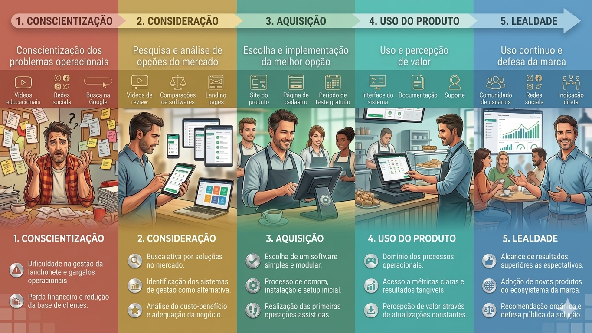
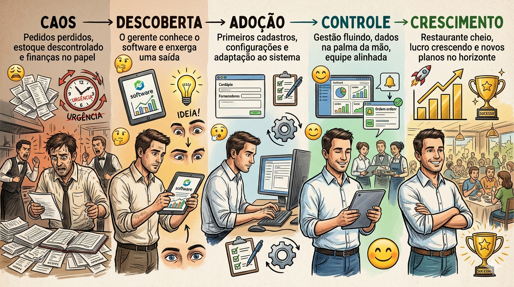
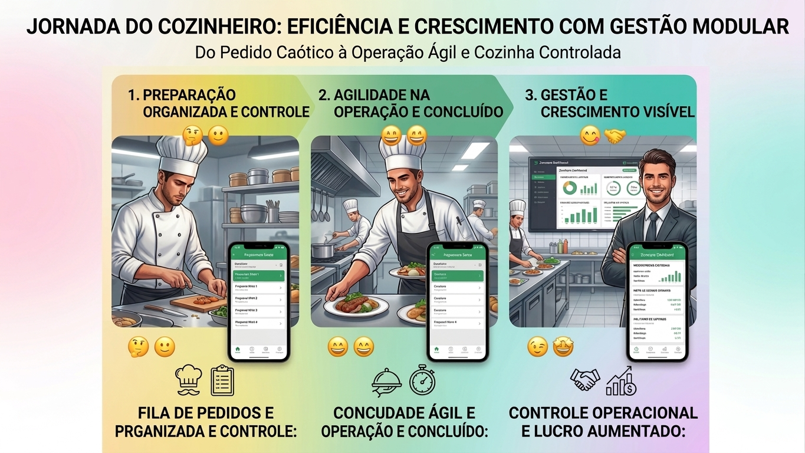
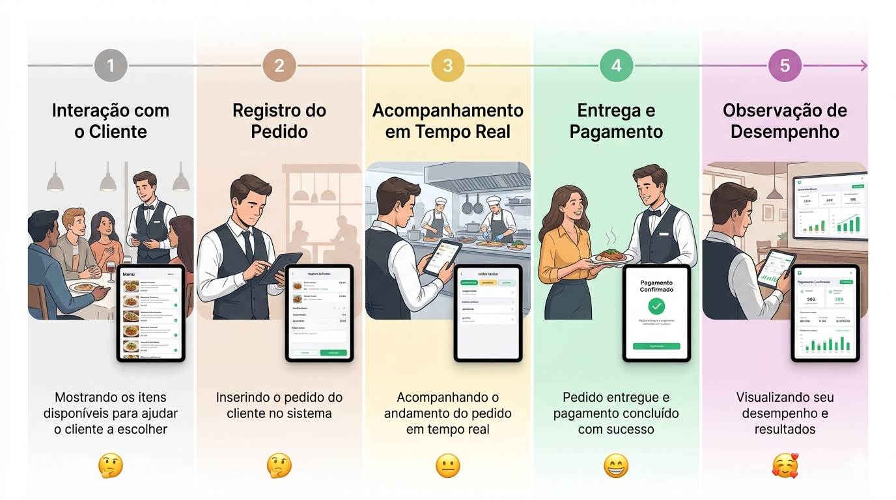

# Documentação Almoçu

# Almoçu PI 4° Semestre - Documentação

# 🛠️ Informações do Projeto

- Nome do Projeto: **Almoçu**
- Integrantes:
    - [Bruno Righi](https://github.com/BrunoozL)
    - [Gabriel Magina Coutinho](https://github.com/Gabriel-M-Coutinho)
    - [Kaique Onencio de Souza](https://github.com/kaiqsou)
    - [Pedro Henrique do Vale Mineo](https://github.com/Valemineo)
    - [Weverton Ryan Nunes de Almeida Silva](https://github.com/wevertonryan)
- Empresa Parceira: **Salgadaria do Ponto**
- Repositório no GitHub: [https://github.com/Beennect/almocu](https://github.com/Beennect/almocu)
- Site do Projeto: [https://beennect.github.io/almocu/](https://beennect.github.io/almocu/)

---

# 📜 Introdução

O projeto [**Almoçu**](https://beennect.github.io/almocu/) é um sistema de gerenciamento inteligente que irá auxiliar as operações de Lanchonetes e Restaurantes, a seguir a documentação completa do projeto.

## Contexto

Lanchonetes e Restaurantes são estabelecimentos normalmente criados por famílias e pequenos empreendedores, gerenciando estabelecimentos de maneira informal

**PROBLEMA -** O negócio cresce, porém o gerenciamento não acompanha, causando:

- Erros em pedidos
- Atrasos na entrega e preparo
- Desperdício de estoque

Isso gera gastos desnecessários, diminuindo o lucro já apertado deles

## Solução Proposta

Um sistema de gestão para simplificar e automatizar as operações de lanchonetes e restaurantes

---

# 📆 Sobre mês de Março

## ✅ O que foi desenvolvido

### 1. Pesquisa de Mercado

- Pesquisa na Internet
- Entrevistas

### 2. Desenvolvimento dos Requisitos

### 3. Protótipo do Figma

### 4. Módulos desenvolvidos

- Menu
- Pedidos
- Estoque

---

## 📝 Backlog

### Quadro Kanban Geral

### Quadro Kanban MVP

---

## **⚠️** Pendências

- Não adquirimos novos clientes
- Não finalizamos o desenvolvimento do MVP

---

## 🚫 Problemas

- Não realizamos reuniões semanais como previsto
- Comunicação entre a equipe não tão boa

---

## ⏩ Próximo mês

- Ter uma versão funcional do projeto

---

# 📌 Requisitos da Aplicação

## 🔨 Requisitos Funcionais

### 1. Módulo PDV

1. Permitir a Registro, Leitura, Alteração e Cancelamento de Pedidos
2. Conectar o sistema com Maquininha e Pix
3. Integrar pedidos do Whatsapp, Ifood e outras plataformas 
4. Restringir algumas operações apenas para administrador (Cancelamento de Pedido)

### 2. Módulo Pedidos

1. Disponilizar uma visualização em tempo real de todos os pedidos com seus respectivos status
2. Permitir a alteração do status do pedido 

### 3. Módulo Menu

1. Permitir Registro, Leitura, Alteração e Deletagem de itens do menu
2. Integrar com itens do estoque para a Ficha técnica (Opcional)

### 4. Estoque

1. Permitir Registro, Leitura, Alteração e Deletagem de itens do estoque
2. Inserir os itens do estoque em XML de nota fiscal
3. Atualizar automaticamente o estoque quando um pedido for feito

### 5. Dashboard (Ponto principal)

1. Capturar dados dos outros módulos para poder montar gráficos
2. Fornecer informações válidas por meio dos dados coletados nos outros módulos

### 6. Sistema

1. Permitir registro e login de usuários no sistema
2. Restringir funcionalidades do sistema por cargo
3. Funcionar offline
4. Realizar Backup de dados automaticamente de maneira periodica
5. Sincronizar dados com a nuvem
6. Coletar dados do uso do sistema com ferramenta de tracking
7. Registrar log das operações

### Aplicação

- Uso do Github actions
- Uso de Docker
- Uso de ferramenta de teste para o backend (Postman)

## 🌠 Requisitos Não Funcionais

1. Simplicidade - Contém apenas os recursos essenciais
2. Flexibilidade - Pode ser utilizado em diferentes contextos sem diminuição da qualidade do serviço
3. Automatizado - O usuário apenas realiza apenas o que é essencial
4. Inteligência - Fornece insights e informações para auxiliar na tomada de decisão
5. Resiliência - O sistema continua funcionando mesmo com imprevistos e não sendo utilizado de maneira correta

---

# 💻 Tecnologias

## Gestão

- Organização do Projeto: Notion
- Divisão de Tarefas: Notion
- Documentação: Github

## Desenvolvimento

- Frontend: React, Tailwind, Ionic
- Backend: Node, Golang
- Versionamento: Git, Github
- Banco: MongoDB

---

# 💼 Modelo de Negócio Canvas

---

# 🗺️ Jornadas CX/UX

## Jornada do cliente completa (CX)

## Jornada do Usuário (UX)

#### 1 - Gerente

#### 2 - Cozinheiro

#### 3 - Garçom

### 4 - Entregador

### 5.1 - Consumidor (Presencialmente)

### 5.2 - Consumidor (Delivery)

---

# 📱 Protótipo

O protótipo foi desenvolvido no Figma. Já há interatividade, mas o objetivo principal é a visualização das páginas e a aplicação do Design.

<aside>

[**Link para o protótipo**](https://www.figma.com/proto/HsCnQrsbUdS3UfWMzkrgMk/Projeto-Integrador-Sem-Nome?node-id=2159-1441&p=f&t=KcRXR3CeZATkitdw-0&scaling=scale-down&content-scaling=fixed&page-id=2159%3A976&starting-point-node-id=2159%3A1441)

</aside>

## Fluxo Principal

1. Adicionamos os itens ao Cardápio do Restaurante ou Lanchonete.
2. Criamos novos pedidos com base no itens do cardápio.
3. Acompanhamos o progresso do pedido na visualização dos pedidos.

---

# 🔍 Pesquisa de Mercado

## 1. Pesquisa Online

Abaixo está o arquivo que o ChatGPT gerou, ele realizou uma pesquisa com dados encontrados na internet, as referencias se encontram no próprio arquivo.

<aside>

[Pesquisa sobre o mercado de Lanchonetes e Restaurantes.pdf](./conteudo/Pesquisa_sobre_o_mercado_de_Lanchonetes_e_Restaurantes.pdf)

</aside>

## 2. Entrevistas

Também confirmamos a pesquisa com entrevistas reais, abaixo se encontram alguns restaurantes e lanchonetes que entrevistamos

1. [Salgadaria do Ponto - Bariri](https://www.google.com/maps/place/Salgadoria+do+Ponto/@-22.0749404,-48.7440938,17z/data=!3m1!4b1!4m6!3m5!1s0x94bf4ae02a47484d:0x585aad5abd86a3c8!8m2!3d-22.0749454!4d-48.7415189!16s%2Fg%2F11flpvw_zy?entry=ttu&g_ep=EgoyMDI2MDMyOS4wIKXMDSoASAFQAw%3D%3D)
2. [Bar da Toninha - Jaú](https://www.google.com/maps/@-22.3152002,-48.5480689,3a,64y,112.19h,82.39t/data=!3m7!1e1!3m5!1sVMCm_b741zC0dZDu7T_GNw!2e0!6shttps:%2F%2Fstreetviewpixels-pa.googleapis.com%2Fv1%2Fthumbnail%3Fcb_client%3Dmaps_sv.tactile%26w%3D900%26h%3D600%26pitch%3D7.607550571241319%26panoid%3DVMCm_b741zC0dZDu7T_GNw%26yaw%3D112.18983186242662!7i16384!8i8192?entry=ttu&g_ep=EgoyMDI2MDMyOS4wIKXMDSoASAFQAw%3D%3D)
3. [Big Batuta - Jaú](https://www.google.com/maps/place/Big+Batuta+Lanches/@-22.2925387,-48.5548534,17z/data=!3m1!4b1!4m6!3m5!1s0x94b8a7a60e3db0f5:0x540eab7d4f78e069!8m2!3d-22.2925387!4d-48.5522785!16s%2Fg%2F11mbs05lys?entry=ttu&g_ep=EgoyMDI2MDMyOS4wIKXMDSoASAFQAw%3D%3D)